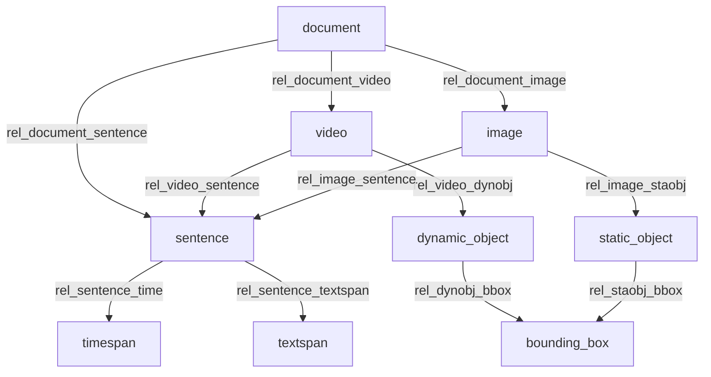

## Relações entre AnnotationObjects

```mermaid
flowchart TB
	sentence -- rel_sentence_time --> timespan
	sentence -- rel_sentence_textspan --> textspan
	document -- rel_document_sentence --> sentence
	document -- rel_document_video --> video
	document -- rel_document_image --> image
	video -- rel_video_sentence --> sentence
	video -- rel_video_dynobj --> dynamic_object
	dynamic_object -- rel_dynobj_bbox --> bounding_box
	static_object -- rel_staobj_bbox --> bounding_box
	image -- rel_image_staobj --> static_object
	image -- rel_image_sentence --> sentence

```
