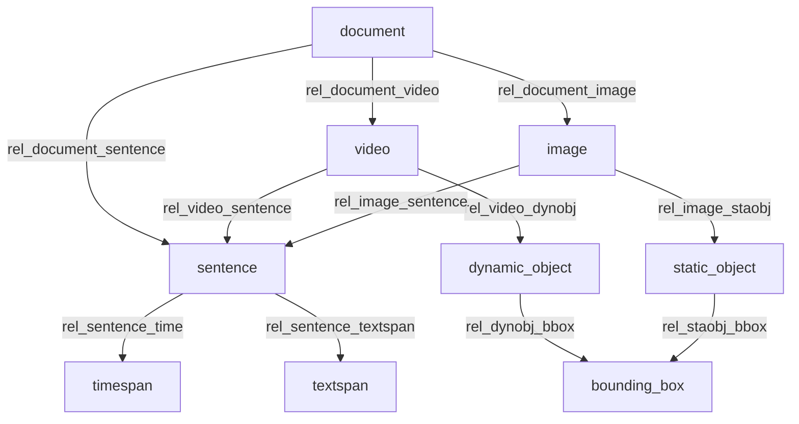

[[annotation.png]]

- Todos os objetos que participam dos processos de anotação estão associados à tabela `annotationobject`.
- As relações entre os objetos de anotação são registradas na tabela `annotationobjectrelation`. Para facilidade de consulta, diversas views fazem referência a esta tabela.

- O campo `annotationobject::externalId` possibilita fazer referência a objetos externos à webtool. Atualmente este campo é usado para associar StaticObjects e TextSpans com os objetos do Flickr30k.

